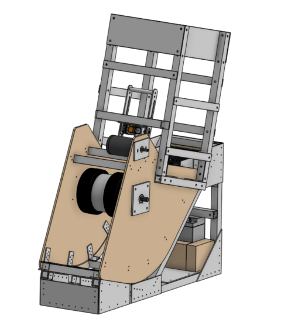
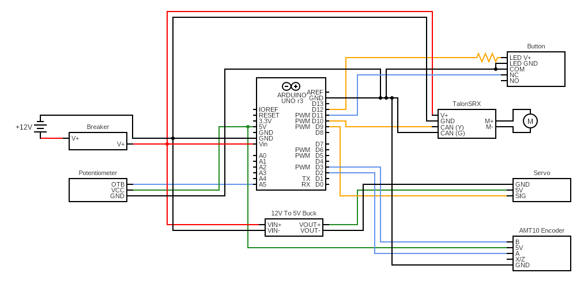

# WheelchairProj

This repository contains all the Controls knowledge for the GRT wheelchair project, which helps a wheelchair-using kid to pass a soccer ball.

## Electrical Diagram

The [latest version of the circuit diagram](https://crcit.net/c/c99bafc2ffc84c31b5bdb6fa0d48855e) is online on circuit-diagram.org.

## Software

An arduino controls the entire mechanism. All the software is in the sketch `wheelchair/wheelchair.ino`.